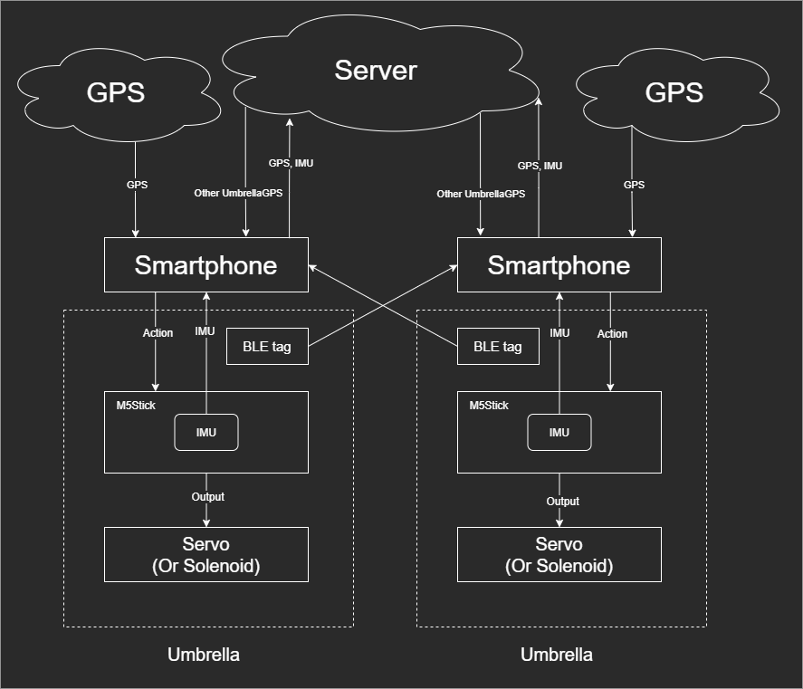
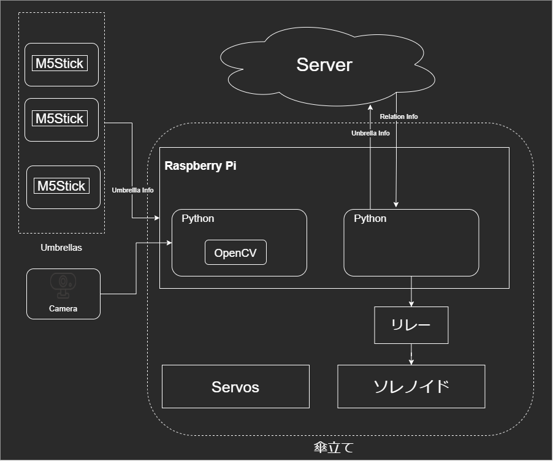
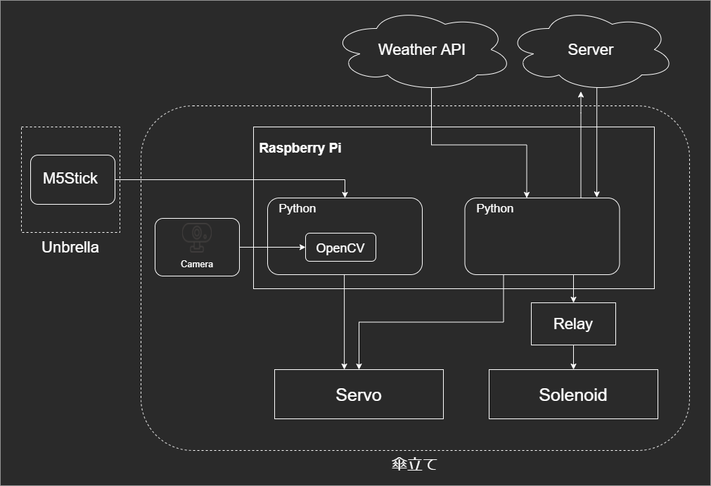

# KASA_WORLD
OpenDesignで製作した傘と傘立てのハードウェアとソフトウェア

# 生きる傘たち（KASAWORLD)
 「生きる傘たち」とは、傘に命を宿し、傘の生態系を作り出すものである。  
 私たちが普段よく使っている「傘」というものの消費量はかなり多い。日本の傘の年間消費量でいうと、約1.2億本。ゴミとなった傘のほとんどはリサイクルではなく埋め立て処分されている…。その中でも約8000万本はビニール傘となっている。天気予報を見なかったために出先で雨が降ってきたから傘を買うことになる、電車に置き忘れる、乱暴に扱ってこわれてしまうなど、廃棄されてしまう原因は様々だ。傘たちは、必要以上に買われ、廃棄されている。 
 傘たちにも命はあるはずなのに…。  
 
 そこで我々は、傘を生かすことにした。 
 傘に愛情を注ごうではないか。
  
 # SYSTEM
  傘と傘について
  
  傘同士のコミュニティ（親密度）について
  
  自宅傘立てについて
  
  
 # Features
  
  - 天気に応じたアクション   傘立てに立てられた「生きた傘たち」は、これから先の天気によって感情を持つ。予報された天気に応じて、喜ぶ・悲しむ・震えるなどのアクションを行う。「生きた傘」の飼い主は、日々天気予報を見ることなく、相棒傘の動きの呼びかけによって傘を持って行くか判断することができる。
 台風の日に震える傘を危険な目に合わせるわけにはいかない。
  - 親密度に応じたアクション   「生きた傘たち」は、互いに仲良くなる。同じ傘立てにいればいるほど仲良くなるという仕組みだ。同じ職場、学校、など、さまざまな場所で共にいた時間を計算し、仲の良さを判別する。そして、仲が良ければ、街中ですれ違った時に傘たちが騒ぎ出す。BLEタグを利用してすれ違いを検出し、傘を動かす。傘たちにも、顔の知れた関係というものがあるのだ。
  - 飼い主の認識   「生きた傘たち」には飼い主がわかる。事前に登録した顔を認識し、飼い主が近づいてくると、そちらを向く。こんなにも愛くるしい傘たちをやすやすと置いて行くわけにはいかない。

